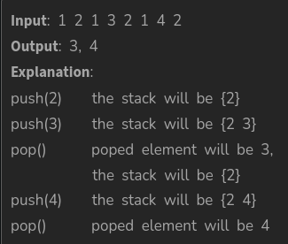

# DSA-Practice

------
### By Ashwin Sharma
- This repository is hosted by me publicly to put all my DSA Practice questions and keep a track of my progress and consistency. 
- I believe there must be a balance between Development and DSA.

---

> Q1. Given an array arr, write a program segregating even and odd numbers. The program should put all even numbers first in sorted order, and then odd numbers in sorted order.
>    Note:- You don't have to return the array, you have to modify it in-place.
>> Input: arr[] = [12, 34, 45, 9, 8, 90, 3]
>>   Output: [8, 12, 34, 90, 3, 9, 45]
>>   Explanation: Even numbers are 12, 34, 8 and 90. Rest are odd numbers.
>
>> Input: arr[] = [0, 1, 2, 3, 4]
>>   Output: [0, 2, 4, 1, 3]
>>   Explanation: 0 2 4 are even and 1 3 are odd numbers.
> 
>> Input: arr[] = [10, 22, 4, 6]
>>   Output: [10, 22, 4, 6]
>>   Explanation: Here all elements are even, so no need of segregataion
>
>  [CLICK to jump to solution](src/EvenOddSegregation.java)

> Q2. Write a program to implement a Stack using Array. Your task is to use the class as shown in the comments in the code editor and complete the functions push() and pop() to implement a stack. The push() method takes one argument, an integer 'x' to be pushed into the stack and pop() which returns an integer present at the top and popped out from the stack. If the stack is empty then return -1 from the pop() method.  
>   Note: The input is given in form of queries. Since there are two operations push() and pop(), there is two types of queries as described below:
>   (i) 1 x   (a query of this type means  pushing 'x' into the stack)
>   (ii) 2     (a query of this type means to pop an element from the stack and print the popped element)
>   Input contains separated by space and as described above.   
> 
>   [CLICK to jump to solution](documentation/stackimplementation.md)

