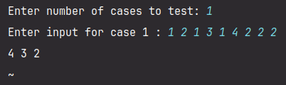

# Stack Implementation using Array

### Usage guide

> ### Sample Usage 
>   

> ### Steps
> 1. Input the number of cases you want to test
> 2. Input the numbers separated by space
> 3. **( 1 = push, 2 = pop )** 
> 4. For instance:  `1 2 1 3 2` pushes 2, then pushes 3 and finally pops

### [CLICK for code](../src/StackImplementation.java)

---

 🐛 [Report bugs](mailto:ashwin.aksharma.p@gmail.com)